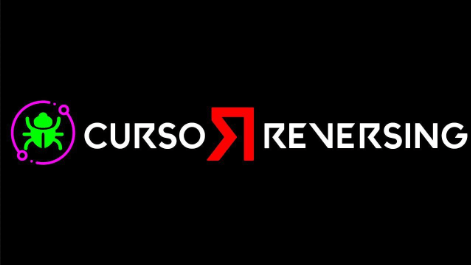

# Bienvenidos a CrackSLatinoS: Un Espacio para la Ingeniería Inversa

En CrackSLatinoS, somos un grupo apasionado de amigos que compartimos el amor por la ingeniería inversa. Fundado en el año 2000 por Ricardo Narvaja, nuestro objetivo siempre ha sido aprender, enseñar y practicar esta fascinante disciplina sin fines comerciales. Aquí, la curiosidad y el deseo de compartir conocimientos son lo que nos mueve, no el lucro.

Nos enorgullece ser una comunidad unida donde tanto expertos como principiantes pueden aprender y crecer juntos. Creemos firmemente en el poder del aprendizaje colaborativo y en la importancia de ayudar a nuestros compañeros. Gracias a la dedicación y apoyo de todos los miembros, hemos creado un entorno donde la amistad y el conocimiento van de la mano.

Si te interesa el apasionante mundo de la ingeniería inversa y quieres ser parte de una comunidad donde el conocimiento es compartido con generosidad y camaradería, ¡CrackSLatinoS es el lugar para ti! Aquí no encontrarás comercio, solo la pura y simple práctica del arte que tanto amamos. ¡Únete a nosotros y sé parte de esta gran familia!

## Redes sociales

- Telegram: <https://t.me/crackslatinos>{ target="_blank" }
- Discord: <https://discord.gg/jrwsENtyqn>{ target="_blank" }
- YouTube: <https://www.youtube.com/channel/UCPNPSP20z4FGfgMJ71VOJjw>{ target="_blank" }
- Twitter: <https://x.com/crackslatinos>{ target="_blank" }
- Google Groups: <https://groups.google.com/g/crackslatinos>{ target="_blank" }
- Pagina Ricardo: <http://ricardonarvaja.info>{ target="_blank" }
- Twitter Ricardo: <https://x.com/ricardonarvaja>{ target="_blank" }
- YouTube Ricardo: <https://www.youtube.com/@ricnar456>{ target="_blank" }
- Twitter Solid: <https://x.com/solid_cls>{ target="_blank" }

## Cursos

<figure markdown="span">
  
  <figcaption markdown="1">[CursoReversing desde cero](CursoReversing-desde-cero/001-x64dbg-primeros-pasos.md)</figcaption>
</figure>

| Curso                                                                                                                                                                        | Enlaces                                                                                                                                                                                                                         |
|------------------------------------------------------------------------------------------------------------------------------------------------------------------------------|---------------------------------------------------------------------------------------------------------------------------------------------------------------------------------------------------------------------------------|
| Nuevo curso de exploiting y reversing usando herramientas gratuitas. (IDA Free, Radare, Ghidra, WinDbg preview, x64Dbg) en castellano e ingles { style="max-width: 300px;" } | [MEGA](https://mega.nz/folder/s2FyFSBI#T8XeVaiKRTSGgp3VZQttlg/folder/pvtxzQ4Z){ target="_blank" } [Ricardo](https://www.ricardonarvaja.info/WEB/EXPLOITING%20Y%20REVERSING%20USANDO%20HERRAMIENTAS%20FREE/){ target="_blank" }  |
| Introduccion al reversing con IDA PRO desde cero                                                                                                                             | [MEGA](https://mega.nz/folder/s2FyFSBI#T8XeVaiKRTSGgp3VZQttlg/folder/52tn1SgQ){ target="_blank" } [Ricardo](https://www.ricardonarvaja.info/WEB/IDA%20DESDE%20CERO/){ target="_blank" }                                         |
| Introducción al cracking con OllyDbg desde cero                                                                                                                              | [MEGA](https://mega.nz/folder/s2FyFSBI#T8XeVaiKRTSGgp3VZQttlg/folder/5nkFXIbQ){ target="_blank" } [Ricardo](http://www.ricardonarvaja.info/WEB/INTRODUCCION%20AL%20CRACKING%20CON%20OLLYDBG%20DESDE%20CERO/){ target="_blank" } |

## Licencia

El contenido de este proyecto en sí tiene licencia bajo
[Creative Commons Zero V1.0 Universal](https://github.com/SceneRE/CrackSLatinoS/blob/main/LICENSE.CC0){ target="_blank" rel="noopener" },
y el código fuente subyacente utilizado para formatear y mostrar dicho contenido tiene licencia bajo
[Unlicense](https://github.com/SceneRE/CrackSLatinoS/blob/main/LICENSE.UNLICENSE){ target="_blank" rel="noopener" }.

Si usted decide aportar al proyecto, ya sea en forma de código fuente o contenido, está aceptando licenciar dichos aportes bajos alguna de las dos licencias del proyecto mencionadas arriba, respectivamente.

## Como aportar

Saliendo del aviso legal obligatorio, por favor, siéntase libre de aportar al proyecto, recuerde siempre las netiquetas, o dicho de otra forma, "sea una buena persona" y todo siempre ira a buen rumbo.